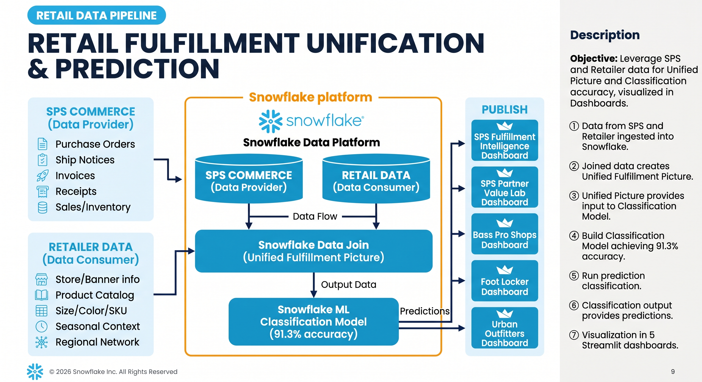

# SPS Retail Fulfillment Intelligence

### Data Join + AI/ML for Retail Supply Chain

*SPS Commerce EDI data joined with retailer operations data, powered by Snowflake ML*

---

## The Problem

Retailers and suppliers operate in silos. **SPS Commerce** sees every order, shipment notice, and invoice flowing through the EDI network — but not what happens at the store. **Retailers** see their shelves, their stores, and their customers — but not the upstream signals that predict whether the next shipment will arrive on time.

Neither side alone can answer the question that matters most:

> **Which orders are going to fail, and what can we do about it before they do?**

---

## The Solution

Join SPS Commerce's EDI transaction data with each retailer's operational data inside Snowflake. Train a machine learning model on the combined dataset. Deploy five interactive dashboards that turn predictions into action.

### The Result

---

## Dashboards

### 1. SPS Fulfillment Intelligence

The cross-retailer command center. Tracks OTIF (On-Time, In-Full) delivery rates, walks through the order-to-cash EDI journey, surfaces ML-predicted risk orders, and flags invoice mismatches.

| | |
|---|---|
|  |  |
| *Fulfillment KPIs by retailer* | *Order-to-cash journey: the data join visualized* |

| | |
|---|---|
|  |  |
| *ML risk distribution and model accuracy* | *Supplier performance: on-time vs in-full* |

---

### 2. SPS + Foot Locker

Footwear launch and size readiness across Foot Locker's four banners: FL, Champs Sports, Kids Foot Locker, and WSS.

**What SPS provides:** EDI order and shipment tracking across all banners
**What Foot Locker adds:** Multi-banner store structure + product catalog with size/color attributes
**What ML delivers:** Risk flags per banner so teams know where to focus before launch day

| | |
|---|---|
|  |  |
| *Size availability by product group* | *ML-predicted risk by banner* |

---

### 3. SPS + Bass Pro Shops

Seasonal availability and inventory intelligence for outdoor recreation categories.

**What SPS provides:** Weekly sell-through and inventory activity data
**What Bass Pro adds:** Seasonal product categories + regional store network with climate zones
**What ML delivers:** Supplier reliability scoring during peak seasons — a late outdoor gear supplier in spring has outsized impact

| | |
|---|---|
|  |  |
| *Regional sales by season* | *Weeks of supply — stockout vs overstock risk* |

---

### 4. SPS + Urban Outfitters

PO revision tracking and SKU readiness for Urban Outfitters' unique vendor program.

**What SPS provides:** EDI PO version tracking (replacement 850s — URBN doesn't use standard change requests)
**What Urban Outfitters adds:** Proprietary URBN short SKU crosswalk + PO acceptance rules
**What ML delivers:** Pre-ship readiness risk combining PO revision patterns, SKU mapping gaps, and supplier history

| | |
|---|---|
|  |  |
| *SKU crosswalk health (Active/Pending/Unresolved)* | *Pre-ship readiness: ML risk vs lead time* |

---

### 5. SPS Partner Value Lab

The value proof. Compares ML model accuracy across all three retailers and shows which data features from the SPS + retailer join drive the most predictive value.

| | |
|---|---|
|  |  |
| *ML accuracy, precision, recall by retailer* | *Feature importance: what SPS data drives predictions* |

---

## The Data Join Story

Every chart in every dashboard is powered by a join between SPS Commerce data and retailer data. Neither dataset alone can produce these insights.

| What SPS Commerce Provides | What the Retailer Provides | What the Join Creates |
|---|---|---|
| Purchase orders (EDI 850) | Store locations, banners | OTIF by banner, region, store |
| Shipment notices (EDI 856) | Product catalog (size, color, SKU) | Size-level availability analysis |
| Invoices (EDI 810) | PO acceptance rules | Invoice mismatch detection |
| Receipts (EDI 861) | Seasonal categories, climate zones | Seasonal demand planning |
| Weekly sales/inventory feed | URBN short SKU crosswalk | SKU mapping validation |
| Supplier transaction history | — | ML features for risk prediction |

---

## Snowflake ML Features

| Feature | How It's Used |
|---|---|
| **`SNOWFLAKE.ML.CLASSIFICATION`** | Trains a fulfillment risk model on 9,919 POs with 22 features from the joined dataset. Predicts `IS_LATE_OR_SHORT` (0/1). |
| **`SHOW_FEATURE_IMPORTANCE()`** | Reveals which data points drive predictions — order value, lead time, and supplier OTIF history are the top signals. |
| **`!PREDICT()`** | Scores every PO in real-time. The PREDICTION variant column contains class and probability for each order. |
| **Streamlit in Snowflake** | 5 dashboards deployed natively — no external compute, no container runtime, instant load. |

### Model Performance

| Metric | Value | What It Means |
|---|---|---|
| **Accuracy** | 91.3% | 9 out of 10 predictions are correct |
| **Precision** | 99.6% | When the model flags a risk, it's almost always real |
| **Recall** | 52.5% | Catches about half of actual problems — conservative, low false alarms |
| **Training Label Split** | 18.3% failure / 81.7% success | Matches real-world retail fulfillment rates |

---

## Data at a Glance

| Dataset | Rows | Description |
|---|---|---|
| **SPS_ACTIVITY** | 2,888,606 | Weekly sales, inventory, returns — 106 periods (Sep 2022 – Sep 2024) |
| **PO_LINE** | 51,143 | Line items with ordered/shipped/received/invoiced quantities |
| **PURCHASE_ORDER** | 10,476 | Order headers across 3 retailers, 20 suppliers |
| **SHIPMENT** | 9,919 | Delivery records with on-time/in-full flags |
| **INVOICE** | 9,919 | Supplier invoices with mismatch detection |
| **RECEIPT** | 9,919 | Receiving records with days-late measurement |
| **ITEM** | 3,580 | Product catalog: style, color, size, brand, UPC, URBN short SKU |
| **LOCATION** | 60 | Stores across 3 retailers with banner, region, climate |
| **SUPPLIER** | 20 | Suppliers with reliability tier and lead time metrics |
| **SKU_CROSSWALK** | 650 | Urban Outfitters URBN-to-UPC mapping (Active/Pending/Unresolved) |
| **TRAINING_DATA** | 9,919 | ML feature set: 22 features per PO from joined SPS + retailer data |

---

## Summary

This project demonstrates how **SPS Commerce EDI data** — purchase orders, shipments, invoices, and weekly activity feeds — becomes dramatically more valuable when joined with **retailer-specific operational data** inside Snowflake. The combined dataset powers a **SNOWFLAKE.ML.CLASSIFICATION** model that predicts fulfillment risk at 91.3% accuracy across 9,919 POs, and five native **Streamlit in Snowflake** dashboards turn those predictions into actionable insights for supply chain teams. From OTIF tracking to invoice mismatch detection to size-level availability analysis, every chart is built on data that neither SPS Commerce nor the retailer could produce alone.

> See [SETUP.md](SETUP.md) for full replication instructions and [DEMO_TALK_TRACK.md](DEMO_TALK_TRACK.md) for a presenter walk-through.

---

*Built on Snowflake — Data Cloud, ML Classification, Streamlit in Snowflake*

