<div align="center">

# SPS Retail Fulfillment Intelligence

### Data Join + AI/ML for Retail Supply Chain

*SPS Commerce EDI data joined with retailer operations data, powered by Snowflake ML*

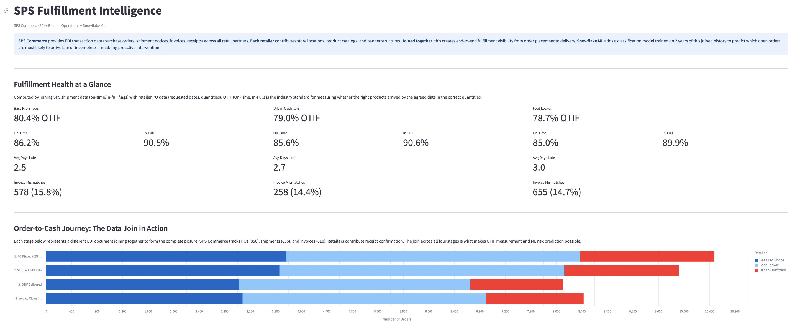
<!-- PLACEHOLDER: Screenshot of the SPS Fulfillment Intelligence dashboard (full page, KPIs + order-to-cash journey visible) -->

</div>

---

## The Problem

Retailers and suppliers operate in silos. **SPS Commerce** sees every order, shipment notice, and invoice flowing through the EDI network — but not what happens at the store. **Retailers** see their shelves, their stores, and their customers — but not the upstream signals that predict whether the next shipment will arrive on time.

Neither side alone can answer the question that matters most:

> **Which orders are going to fail, and what can we do about it before they do?**

---

## The Solution

Join SPS Commerce's EDI transaction data with each retailer's operational data inside Snowflake. Train a machine learning model on the combined dataset. Deploy five interactive dashboards that turn predictions into action.

```
┌─────────────────────┐     ┌──────────────────────┐
│   SPS Commerce      │     │   Retailer Data       │
│   (Data Provider)   │     │   (Data Consumer)     │
│                     │     │                       │
│  • Purchase Orders  │     │  • Store/Banner info  │
│  • Ship Notices     │     │  • Product Catalog    │
│  • Invoices         │     │  • Size/Color/SKU     │
│  • Receipts         │     │  • Seasonal Context   │
│  • Sales/Inventory  │     │  • Regional Network   │
└────────┬────────────┘     └───────┬──────────────┘
         │                          │
         └──────────┬───────────────┘
                    │
            ┌───────▼───────┐
            │  Snowflake    │
            │  Data Join    │
            │               │
            │  Unified      │
            │  Fulfillment  │
            │  Picture      │
            └───────┬───────┘
                    │
            ┌───────▼───────┐
            │  Snowflake ML │
            │               │
            │  Classification│
            │  Model        │
            │  91.3% acc    │
            └───────┬───────┘
                    │
            ┌───────▼───────┐
            │  5 Streamlit  │
            │  Dashboards   │
            │  in Snowflake │
            └───────────────┘
```

---

## Dashboards

### 1. SPS Fulfillment Intelligence

The cross-retailer command center. Tracks OTIF (On-Time, In-Full) delivery rates, walks through the order-to-cash EDI journey, surfaces ML-predicted risk orders, and flags invoice mismatches.

| | |
|---|---|
| 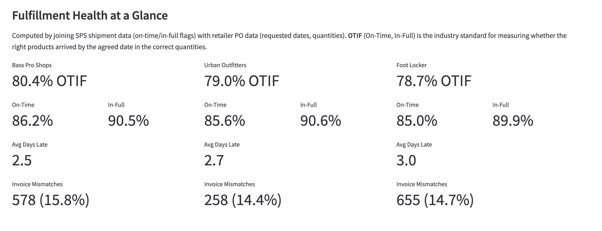 | 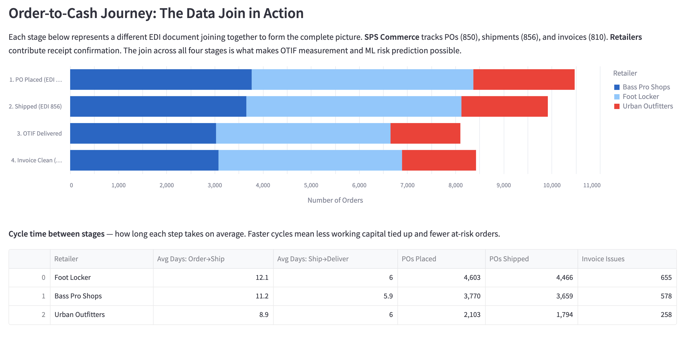 |
| *Fulfillment KPIs by retailer* | *Order-to-cash journey: the data join visualized* |

<!-- PLACEHOLDER: Two screenshots side by side — (1) KPI metrics cards for all 3 retailers, (2) Order-to-cash funnel chart -->

| | |
|---|---|
| 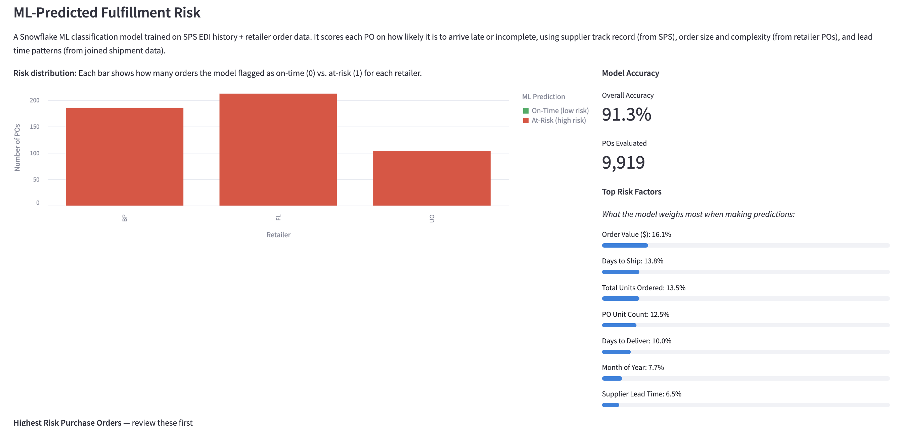 | 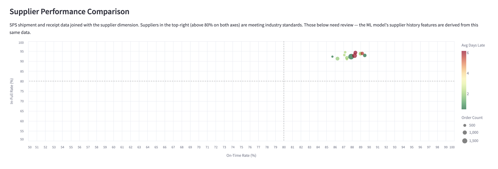 |
| *ML risk distribution and model accuracy* | *Supplier performance: on-time vs in-full* |

<!-- PLACEHOLDER: Two screenshots — (1) ML risk bar chart + accuracy metrics + feature importance, (2) Supplier scatter plot -->

---

### 2. SPS + Foot Locker

Footwear launch and size readiness across Foot Locker's four banners: FL, Champs Sports, Kids Foot Locker, and WSS.

**What SPS provides:** EDI order and shipment tracking across all banners
**What Foot Locker adds:** Multi-banner store structure + product catalog with size/color attributes
**What ML delivers:** Risk flags per banner so teams know where to focus before launch day

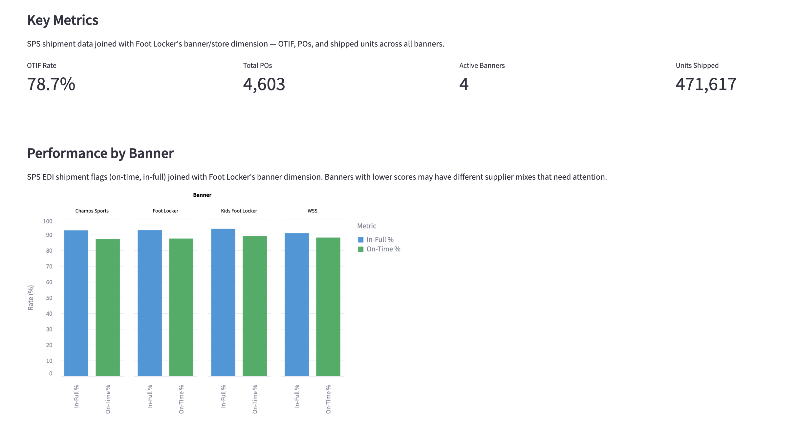
<!-- PLACEHOLDER: Screenshot showing banner performance comparison chart (On-Time % and In-Full % grouped by banner) -->

| | |
|---|---|
| 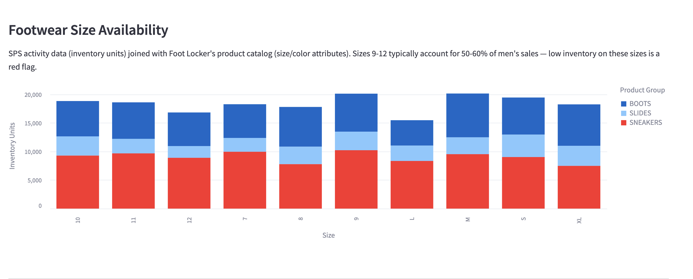 | 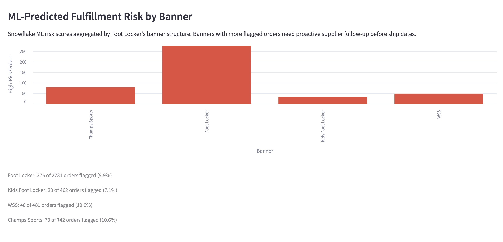 |
| *Size availability by product group* | *ML-predicted risk by banner* |

<!-- PLACEHOLDER: Two screenshots — (1) Size availability bar chart, (2) ML risk by banner bar chart -->

---

### 3. SPS + Bass Pro Shops

Seasonal availability and inventory intelligence for outdoor recreation categories.

**What SPS provides:** Weekly sell-through and inventory activity data
**What Bass Pro adds:** Seasonal product categories + regional store network with climate zones
**What ML delivers:** Supplier reliability scoring during peak seasons — a late outdoor gear supplier in spring has outsized impact

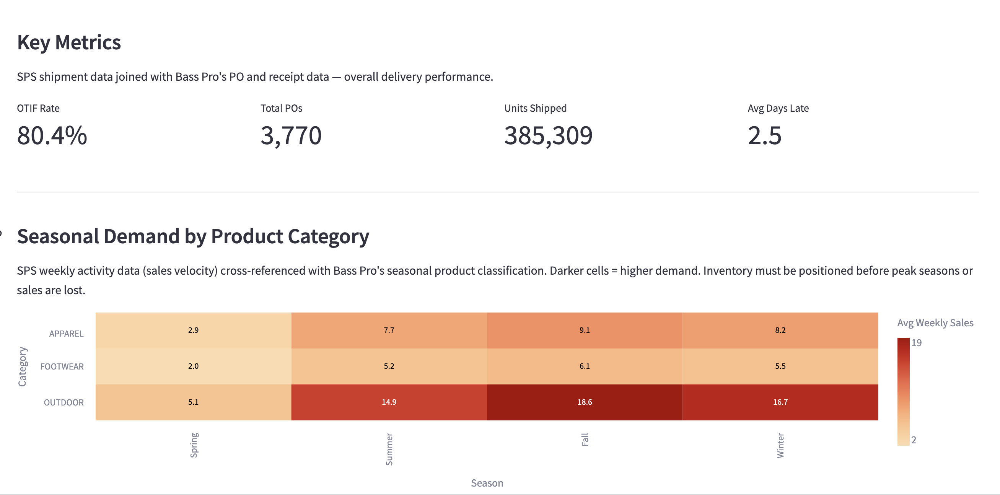
<!-- PLACEHOLDER: Screenshot of the seasonal demand heatmap (category x season, colored cells with values) -->

| | |
|---|---|
| 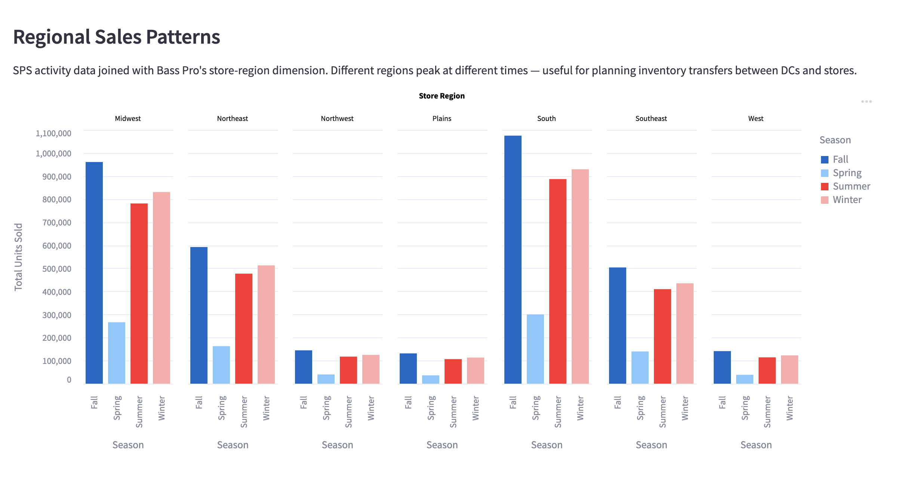 | 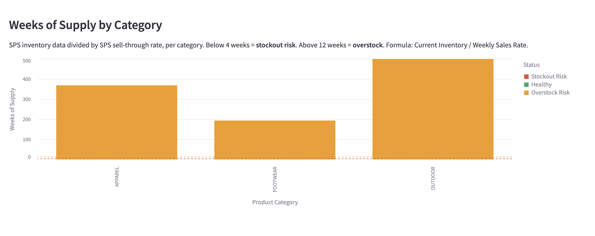 |
| *Regional sales by season* | *Weeks of supply — stockout vs overstock risk* |

<!-- PLACEHOLDER: Two screenshots — (1) Regional sales grouped bar chart, (2) Weeks of supply bar chart with red/green/yellow risk lines -->

---

### 4. SPS + Urban Outfitters

PO revision tracking and SKU readiness for Urban Outfitters' unique vendor program.

**What SPS provides:** EDI PO version tracking (replacement 850s — URBN doesn't use standard change requests)
**What Urban Outfitters adds:** Proprietary URBN short SKU crosswalk + PO acceptance rules
**What ML delivers:** Pre-ship readiness risk combining PO revision patterns, SKU mapping gaps, and supplier history

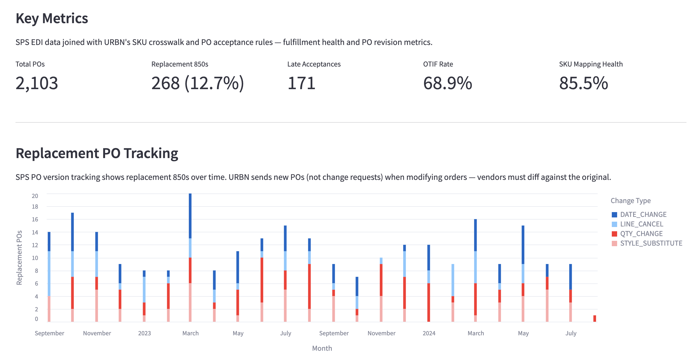
<!-- PLACEHOLDER: Screenshot of replacement PO tracking stacked bar chart (month x revision type) -->

| | |
|---|---|
| 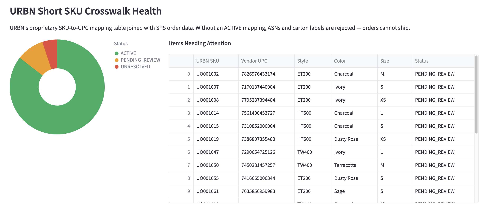 | 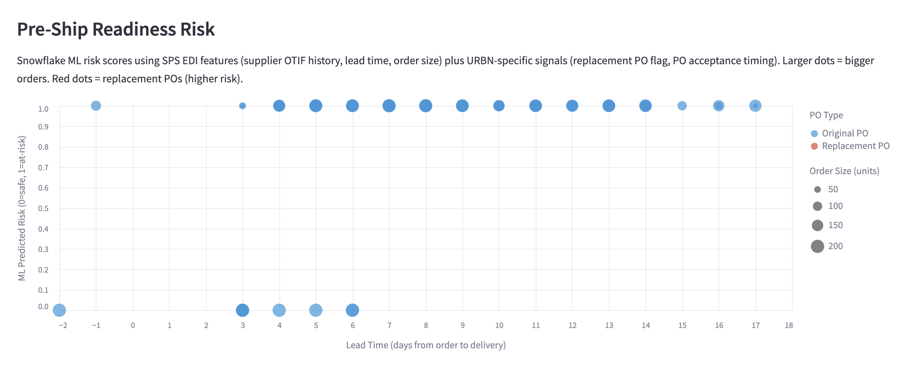 |
| *SKU crosswalk health (Active/Pending/Unresolved)* | *Pre-ship readiness: ML risk vs lead time* |

<!-- PLACEHOLDER: Two screenshots — (1) SKU donut chart + items needing attention table, (2) Scatter plot of risk vs lead time colored by PO type -->

---

### 5. SPS Partner Value Lab

The value proof. Compares ML model accuracy across all three retailers and shows which data features from the SPS + retailer join drive the most predictive value.

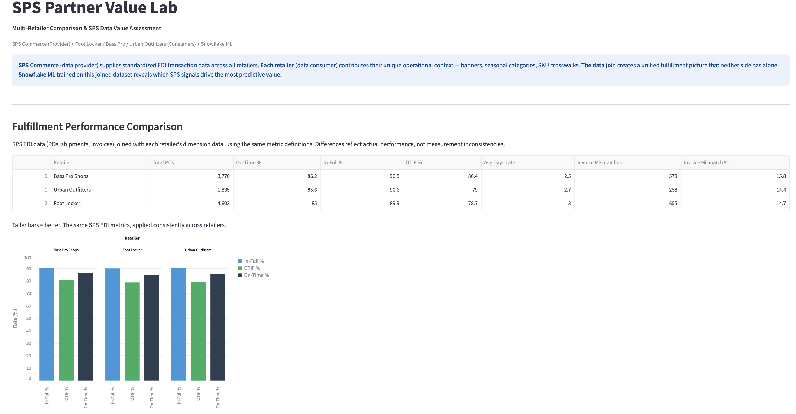
<!-- PLACEHOLDER: Screenshot of cross-retailer performance comparison (grouped bar chart + data table) -->

| | |
|---|---|
| 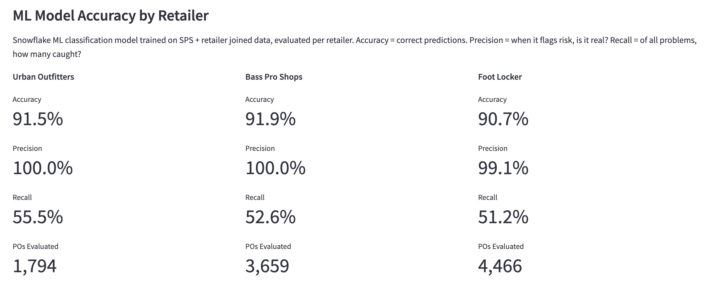 | 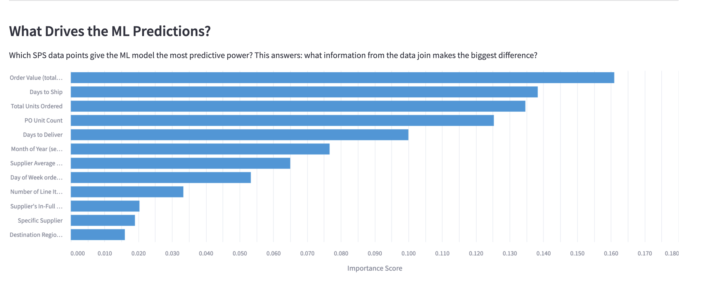 |
| *ML accuracy, precision, recall by retailer* | *Feature importance: what SPS data drives predictions* |

<!-- PLACEHOLDER: Two screenshots — (1) Accuracy/Precision/Recall metric cards for each retailer, (2) Horizontal bar chart of feature importance scores -->

---

## The Data Join Story

Every chart in every dashboard is powered by a join between SPS Commerce data and retailer data. Neither dataset alone can produce these insights.

| What SPS Commerce Provides | What the Retailer Provides | What the Join Creates |
|---|---|---|
| Purchase orders (EDI 850) | Store locations, banners | OTIF by banner, region, store |
| Shipment notices (EDI 856) | Product catalog (size, color, SKU) | Size-level availability analysis |
| Invoices (EDI 810) | PO acceptance rules | Invoice mismatch detection |
| Receipts (EDI 861) | Seasonal categories, climate zones | Seasonal demand planning |
| Weekly sales/inventory feed | URBN short SKU crosswalk | SKU mapping validation |
| Supplier transaction history | — | ML features for risk prediction |

---

## Snowflake ML Features

| Feature | How It's Used |
|---|---|
| **`SNOWFLAKE.ML.CLASSIFICATION`** | Trains a fulfillment risk model on 9,919 POs with 22 features from the joined dataset. Predicts `IS_LATE_OR_SHORT` (0/1). |
| **`SHOW_FEATURE_IMPORTANCE()`** | Reveals which data points drive predictions — order value, lead time, and supplier OTIF history are the top signals. |
| **`!PREDICT()`** | Scores every PO in real-time. The PREDICTION variant column contains class and probability for each order. |
| **Streamlit in Snowflake** | 5 dashboards deployed natively — no external compute, no container runtime, instant load. |

### Model Performance

| Metric | Value | What It Means |
|---|---|---|
| **Accuracy** | 91.3% | 9 out of 10 predictions are correct |
| **Precision** | 99.6% | When the model flags a risk, it's almost always real |
| **Recall** | 52.5% | Catches about half of actual problems — conservative, low false alarms |
| **Training Label Split** | 18.3% failure / 81.7% success | Matches real-world retail fulfillment rates |

---

## Data at a Glance

| Dataset | Rows | Description |
|---|---|---|
| **SPS_ACTIVITY** | 2,888,606 | Weekly sales, inventory, returns — 106 periods (Sep 2022 – Sep 2024) |
| **PO_LINE** | 51,143 | Line items with ordered/shipped/received/invoiced quantities |
| **PURCHASE_ORDER** | 10,476 | Order headers across 3 retailers, 20 suppliers |
| **SHIPMENT** | 9,919 | Delivery records with on-time/in-full flags |
| **INVOICE** | 9,919 | Supplier invoices with mismatch detection |
| **RECEIPT** | 9,919 | Receiving records with days-late measurement |
| **ITEM** | 3,580 | Product catalog: style, color, size, brand, UPC, URBN short SKU |
| **LOCATION** | 60 | Stores across 3 retailers with banner, region, climate |
| **SUPPLIER** | 20 | Suppliers with reliability tier and lead time metrics |
| **SKU_CROSSWALK** | 650 | Urban Outfitters URBN-to-UPC mapping (Active/Pending/Unresolved) |
| **TRAINING_DATA** | 9,919 | ML feature set: 22 features per PO from joined SPS + retailer data |

---

## Repo Structure

```
sps_retail_fulfillment_intelligence/
│
├── README.md                       ← You are here
├── SETUP.md                        ← Full replication guide
├── DEMO_TALK_TRACK.md              ← Presenter walk-through
│
├── SPS_DATAMODEL.md                ← SPS Commerce provider data model
├── FOOTLOCKER_DATAMODEL.md         ← Foot Locker consumer data model
├── BASSPRO_DATAMODEL.md            ← Bass Pro Shops consumer data model
├── URBANOUTFITTERS_DATAMODEL.md    ← Urban Outfitters consumer data model
│
├── apps/                           ← 5 Streamlit dashboard source files
│   ├── sps_fulfillment_intelligence.py
│   ├── sps_foot_locker.py
│   ├── sps_bass_pro.py
│   ├── sps_urban_outfitters.py
│   └── sps_partner_value_lab.py
│
├── data/                           ← All datasets as CSV
│   ├── shared/                     ← 11 tables (retailer, supplier, item, ...)
│   │   └── sps_activity.csv.gz    ← 2.9M rows, gzipped (~43MB)
│   ├── ml_models/                  ← ML training data
│   └── urban_outfitters/           ← SKU crosswalk
│
├── setup/                          ← SQL + shell scripts for full replication
│   ├── 01_environment.sql          ← Database, schemas, stages
│   ├── 02_load_data.sql            ← CREATE TABLE + COPY INTO
│   ├── 03_views.sql                ← Analytical views
│   ├── 04_ml_model.sql             ← SNOWFLAKE.ML.CLASSIFICATION train + predict
│   ├── 05_streamlit_apps.sql       ← CREATE STREAMLIT (native runtime)
│   └── upload_data.sh              ← Upload data + apps to Snowflake stages
│
└── images/                         ← Dashboard screenshots
```

---

## Quick Start

> See [SETUP.md](SETUP.md) for detailed step-by-step instructions.

```bash
# 1. Create database, schemas, and stages
snow sql -f setup/01_environment.sql --connection coco_conn

# 2. Upload CSV data and Streamlit apps to Snowflake stages
bash setup/upload_data.sh coco_conn

# 3. Create tables and load data
snow sql -f setup/02_load_data.sql --connection coco_conn

# 4. Create analytical views
snow sql -f setup/03_views.sql --connection coco_conn

# 5. Train ML model and generate predictions
snow sql -f setup/04_ml_model.sql --connection coco_conn

# 6. Deploy Streamlit dashboards
snow sql -f setup/05_streamlit_apps.sql --connection coco_conn
```

**Prerequisites:** Snowflake account, [Snowflake CLI](https://docs.snowflake.com/en/developer-guide/snowflake-cli/index) v3.14+, a role with `CREATE DATABASE` privileges.

---

## Documentation

| Document | Description |
|---|---|
| [SETUP.md](SETUP.md) | Complete replication guide with verification steps |
| [DEMO_TALK_TRACK.md](DEMO_TALK_TRACK.md) | Presenter script: executive opening → 5 dashboards → closing |
| [SPS_DATAMODEL.md](SPS_DATAMODEL.md) | SPS Commerce data model (EDI documents + activity feed) |
| [FOOTLOCKER_DATAMODEL.md](FOOTLOCKER_DATAMODEL.md) | Foot Locker data model (banners, sizes, launches) |
| [BASSPRO_DATAMODEL.md](BASSPRO_DATAMODEL.md) | Bass Pro Shops data model (seasons, regions, climate) |
| [URBANOUTFITTERS_DATAMODEL.md](URBANOUTFITTERS_DATAMODEL.md) | Urban Outfitters data model (SKU crosswalk, replacement POs) |

---

<div align="center">

*Built on Snowflake — Data Cloud, ML Classification, Streamlit in Snowflake*

</div>
